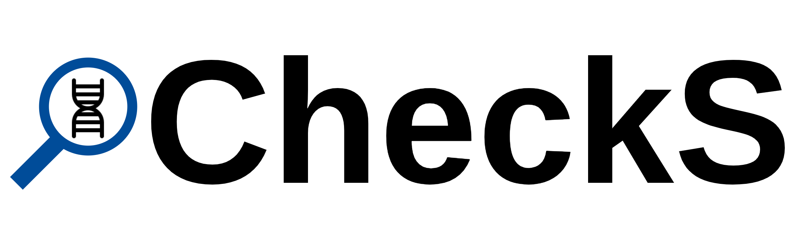

<p align="center">
  
</p>

# CheckS: Checking the presence of a species in a metagenomics sample

## Getting Started

### Dependencies
CheckS requires Python 3.7 (tested on Python 3.7.4). You will need the following tools and python packages installed. Versions tested on are listed as well.
* [DSK](https://github.com/GATB/dsk) - version 2.3.3
* [Minimap2](https://github.com/lh3/minimap2) - version 2.18
* [CoverM](https://github.com/wwood/CoverM) - version 0.6.1
* [QUAST](http://bioinf.spbau.ru/quast) - version 5.0.2
* [Biopython](https://biopython.org/) - version 1.74

### Downloading GraphBin2
You can download the latest release of CheckS from [Releases](https://github.com/Vini2/CheckS/releases) or clone the CheckS repository to your machine.

```
git clone https://github.com/Vini2/CheckS.git
```

If you have downloaded a release, you will have to extract the files using the following command.

```
unzip [file_name].zip
```

Now go in to the CheckS folder using the command

```
cd CheckS/
```

### Setting up the environment
We recommend that you use [Conda](https://docs.conda.io/en/latest/) to run CheckS. You can download [Anaconda](https://www.anaconda.com/distribution/) or [Miniconda](https://docs.conda.io/en/latest/miniconda.html) which contains Conda.

Once you have installed Conda, make sure you are in the CheckS folder. Now run the following commands to create a Conda environment and activate it to run CheckS.

```
conda env create -f environment.yml
conda activate checks
```

Now you are ready to run CheckS.

If you want to switch back to your normal environment, run the following command.

```
conda deactivate
```
